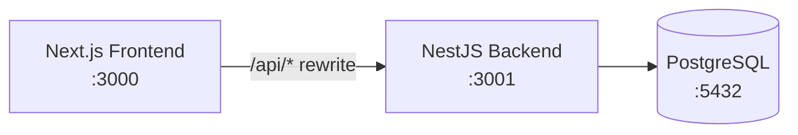

# Architecture

This document describes the structure of the Micro-Messaging Board, the reasoning behind key decisions, and suggested next steps.

## System overview



The frontend and backend run as separate processes in development. PostgreSQL is provided via Docker Compose. The Next.js dev server rewrites `/api/*` to the NestJS API so the browser makes same-origin requests and auth cookies work without CORS friction.

---

## Application structure

### Backend (NestJS)

The API follows a **Controller → Service → Repository** layout with feature modules:

```
backend/src/
├── main.ts                 Bootstrap, CORS, global ValidationPipe
├── app.module.ts           Root module (Config, TypeORM, features)
├── config/                 Joi-validated environment config
├── database/               TypeORM DataSource + migrations
├── auth/                   Register, login, refresh; JWT strategies
├── users/                  User entity and service
├── messages/               CRUD, filtering, ownership guard
└── common/                 Shared decorators (e.g. @CurrentUser)
```

**Controllers** handle routing, DTO binding, and guard application. **Services** contain all business logic (QueryBuilder queries, token issuance, ownership checks). **Entities** map to PostgreSQL tables via TypeORM.

Migrations are explicit and reversible; `synchronize: false` is enforced so schema changes never happen implicitly at runtime.

### Frontend (Next.js 14 App Router)

```
frontend/app/
├── layout.tsx              AuthProvider + QueryProvider
├── middleware.ts           Route protection via refresh cookie
├── (auth)/                 Login and register pages
├── messages/               Main feed page
├── components/             MessageCard, MessageComposer, FilterBar, etc.
├── context/                AuthContext (session state)
├── hooks/                  useMessagesFeed, useMessageMutations, useAuth
└── lib/                    API client, tag constants
```

Server Components are used where possible; interactive pages (`/messages`, auth forms) are Client Components because they rely on React Query, form state, and browser APIs.

### Database

Two core tables:

- **users** — `email`, `username` (both unique), `password_hash`
- **messages** — `content` (max 240), `tag`, `author_id` FK → users

Composite indexes on `(created_at, id)`, `(tag, created_at, id)`, and `(author_id, created_at, id)` align with the three main feed access patterns (default feed, tag filter, user filter).

---

## Key decisions

### Authentication

**Decision:** Short-lived JWT access token (returned in the response body, held in memory on the client) plus a long-lived refresh token stored in an `httpOnly`, `sameSite=lax` cookie.

**Why:**

- Avoids storing tokens in `localStorage`, which is vulnerable to XSS
- Keeps the API stateless and horizontally scalable (no server-side session store)
- Silent refresh on 401 lets the UI recover without forcing a full re-login

**Trade-off:** A hard page refresh clears the in-memory access token; the app restores the session by calling `POST /auth/refresh` with the cookie on mount.

Next.js middleware checks for the `refresh_token` cookie to gate `/messages` and redirect unauthenticated users to `/login`.

### Tagging

**Decision:** A fixed enum — `General`, `Tech`, `Random`, `Announcement`, `Question` — validated at the application layer.

**Why:** Deterministic filter UI (dropdown), no separate `tags` table for v1, and simpler queries. Free-form tags would require normalization, deduplication, and fuzzy search — out of scope for the initial release.

### Filtering

**Decision:** A single parameterized TypeORM QueryBuilder query combining optional `tag`, `username`, `from`, and `to` filters.

**Why:**

- One query path is easier to test, index, and reason about than multiple endpoint variants
- Filtering by **username** (not raw UUID) matches user expectations; the backend joins `messages.author` and matches `author.username`
- Date/time filters accept ISO 8601 strings and apply `>=` / `<=` on `created_at`

All filter parameters are validated via `QueryMessagesDto` with `class-validator`.

### Pagination

**Decision:** Cursor-based (keyset) pagination on `(created_at, id)`, returning `{ items, nextCursor }`.

**Why:**

- `OFFSET/LIMIT` degrades on large tables and produces unstable pages when new rows are inserted during scroll — both realistic for a live feed
- Keyset pagination pairs naturally with the composite indexes and avoids a separate sort step
- The cursor encodes `createdAt|id` and the query fetches rows strictly "before" that point in sort order

The frontend uses TanStack React Query `useInfiniteQuery` with an `IntersectionObserver` sentinel for lazy loading.

### Ownership enforcement

**Decision:** A dedicated `MessageOwnerGuard` on `PATCH` and `DELETE` routes, returning `403 Forbidden` when `message.authorId !== req.user.id`.

**Why:** Authorization must be enforced server-side regardless of what the UI shows. The frontend additionally hides edit/delete controls for non-owners (defense in depth).

### Validation and error handling

**Decision:** Global `ValidationPipe` with `whitelist: true`, `forbidNonWhitelisted: true`, and `transform: true`.

**Why:**

- Strips unknown properties from request bodies
- Rejects requests with extra fields early
- DTOs with `class-validator` decorators enforce shape at the boundary (email format, password length, message max 240 chars, enum tags)

Errors currently use NestJS default HTTP exception responses (`statusCode`, `message`, `error`). A custom global exception filter for a uniform `{ statusCode, message, error, timestamp, path }` envelope is a planned follow-up.

### Frontend data layer

**Decision:** TanStack React Query for the message feed and mutations.

**Why:** Built-in caching, retry, infinite pagination, and optimistic updates for edit/delete. Create mutations prepend to the feed when no filters are active, or invalidate the query when filters would exclude the new message.

---

## Scaling considerations

At MVP scale a single NestJS instance and one Postgres instance are sufficient. If read load grows to thousands of requests per second, the stateless JWT design supports horizontal scaling behind a load balancer. Additional measures would include:

- **Redis cache-aside** for hot feeds (short TTL, invalidate on writes)
- **Postgres read replicas** for `GET /messages`; writes stay on the primary
- **CDN** for static frontend assets
- **Rate limiting** (`@nestjs/throttler` or gateway-level) on write endpoints
- **Observability** — structured logging (pino), Prometheus/Grafana metrics, promtail and loki for logs research

The composite indexes and keyset pagination already in place are prerequisites for these scaling steps.

---

## Testing (current state)

| Layer | Coverage |
|-------|----------|
| Backend unit | `MessagesService.create()` — valid payload, content length, invalid tag |
| Backend e2e | Auth register validation |
| Frontend component | `MessageCard` — inline edit toggle, save, cancel, non-owner controls hidden |

Tests mock database dependencies on the backend and use Testing Library on the frontend.

---

## Suggested next steps

### Testing

- Expand backend unit tests for `findMany()` (filters, cursor pagination, invalid cursor)
- Add integration tests for auth flow (register → login → refresh → protected route)
- Add `MessageComposer` component tests
- Introduce Playwright or Cypress for end-to-end browser tests (register, post, filter, edit, delete)
- Set coverage thresholds in CI

### Error handling and observability

- Implement a global `HttpExceptionFilter` with a consistent error envelope
- Add structured request logging (e.g. `nestjs-pino`) with request ID and latency
- Add a `/health` endpoint with a database ping (`@nestjs/terminus`)

### CI/CD

- GitHub Actions (or similar) pipeline:
  1. Lint backend and frontend
  2. Run unit tests
  3. Build both apps
  4. Run migrations against a test Postgres service container
  5. Run e2e tests
- Dependabot or Renovate for dependency updates
- Require PR checks before merge

### Deployment

- Run the full stack with `docker compose -f docker-compose.full.yml up --build` (see [README.md](./README.md))
- Use managed Postgres (RDS, Cloud SQL, Supabase) in production
- Deploy frontend to Vercel or as a static/containerized Next.js build
- Deploy backend to a container platform (Fly.io, ECS, Cloud Run, k8s)
- Set `secure: true` on refresh cookies and use HTTPS in production
- Store secrets in a vault or platform secret manager (not committed `.env` files)

* above described ideal Deployment, however everything can be deployed using docker compose on vpc (ec2) with free ssl certs and nginx

### Product and schema evolution

- Normalize tags into a dedicated `tags` table if free-form or user-created tags are needed
- Add full-text search (PostgreSQL `tsvector` or Elasticsearch) if message search becomes a requirement
- Consider a denormalized read model (CQRS) if filter combinations grow beyond what indexes can cover efficiently

---

## Related documents

- [README.md](./README.md) — local setup instructions
- [Answers.md](./Answers.md) — scaling, latency, fault tolerance, and monitoring
- [Project_Plan.md](./Project_Plan.md) — requirements and phased development roadmap
