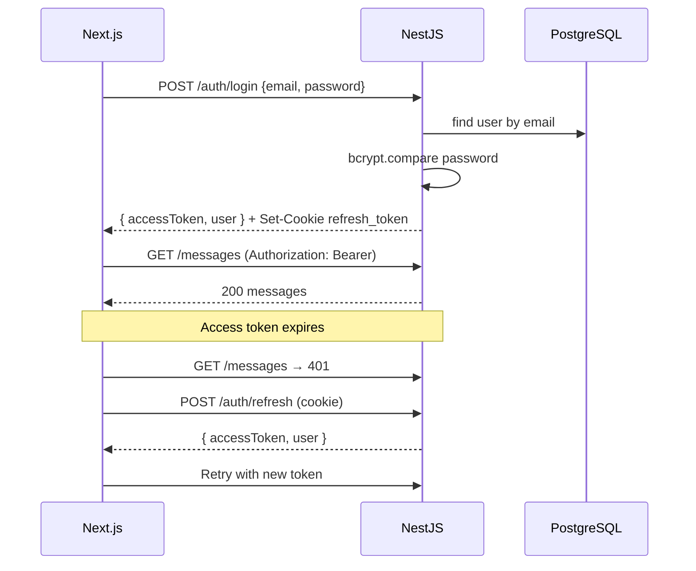

---
tags:
  - backend
  - auth
  - security
---

# Authentication

## Token model

| Token | Lifetime | Storage | Used for |
|-------|----------|---------|----------|
| **Access** | 15m (configurable) | In-memory on client | `Authorization: Bearer` header |
| **Refresh** | 7d (configurable) | `httpOnly` cookie `refresh_token` | `POST /auth/refresh` |

## Flow



## Backend components

| File | Role |
|------|------|
| `auth.controller.ts` | `/register`, `/login`, `/refresh` routes |
| `auth.service.ts` | bcrypt hashing, token issuance, cookie setting |
| `jwt.strategy.ts` | Validates access token from `Authorization` header |
| `jwt-refresh.strategy.ts` | Validates refresh token from cookie |
| `jwt-auth.guard.ts` | Protects routes requiring access token |
| `jwt-refresh-auth.guard.ts` | Protects `/auth/refresh` |

## Password security

- Hashed with **bcrypt**, 12 rounds
- Minimum length: **8 characters** (`RegisterDto`)
- Login uses generic `"Invalid credentials"` to avoid user enumeration

## Cookie settings

```typescript
{
  httpOnly: true,
  secure: nodeEnv === 'production',
  sameSite: 'lax',
  path: '/',
  maxAge: /* parsed from JWT_REFRESH_TTL */
}
```

## Frontend integration

| File | Role |
|------|------|
| `AuthContext.tsx` | Holds `user` state, login/register/logout |
| `lib/api.ts` | Stores access token in module variable; auto-refresh on 401 |
| `middleware.ts` | Redirects based on `refresh_token` cookie presence |

## Session restore

On app load, `AuthContext` calls `restoreSession()` → `POST /auth/refresh` with cookie. If valid, user is logged in without visiting `/login`.

## Related notes

- [[Getting Started/Login and Credentials]]
- [[Backend/API Reference]]
- [[Frontend/Next.js Structure]]
