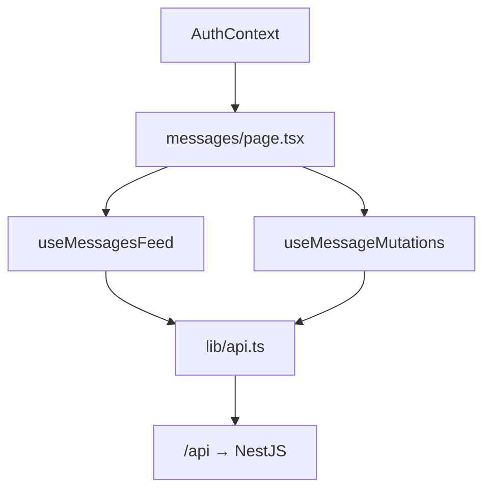

---
tags:
  - frontend
  - nextjs
---

# Next.js Structure

## App Router layout

```
frontend/app/
├── layout.tsx              Root layout, AuthProvider, QueryProvider
├── page.tsx                Redirects to /login
├── middleware.ts           Auth gate via refresh_token cookie
├── (auth)/
│   ├── login/page.tsx
│   └── register/page.tsx
├── messages/
│   └── page.tsx            Main feed page
├── components/
├── context/
│   └── AuthContext.tsx
├── hooks/
└── lib/
    ├── api.ts              Fetch wrapper + token management
    └── tags.ts             Tag enum mirror
```

## Routing & auth middleware

`middleware.ts` runs on `/`, `/login`, `/register`, `/messages/*`:

| Condition | Action |
|-----------|--------|
| No cookie + protected path | Redirect → `/login` |
| Has cookie + auth pages | Redirect → `/messages` |
| `/` | Redirect → `/messages` or `/login` |

## API proxy

`next.config.mjs` rewrites:

```text
/api/:path*  →  BACKEND_URL/:path*
```

Client code uses `NEXT_PUBLIC_API_URL=/api` so all requests are same-origin (cookies work).

## Server vs client components

| Page | Type | Why |
|------|------|-----|
| `login`, `register` | Client | Form state, `useAuth` |
| `messages` | Client | React Query, infinite scroll, mutations |
| `layout` | Server | Wraps providers |

## Providers (`layout.tsx`)

1. **AuthProvider** — user session, login/logout
2. **QueryProvider** — TanStack React Query client

## Data flow (messages page)



## Related notes

- [[Frontend/Components and Hooks]]
- [[Backend/Authentication]]
- [[Getting Started/Running Locally]]
