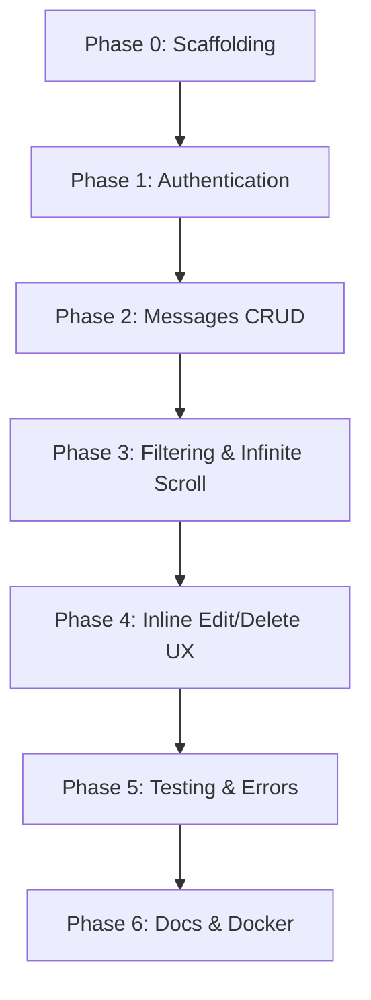

---
tags:
  - history
  - development
---

# Development Phases

This document describes **how the application was created**, following the phased roadmap in `Project_Plan.md`. The project was built incrementally with Cursor AI agents acting as virtual team roles: **Senior Architect**, **Database Lead**, and **Security & QA Guard**.

## Overview

---

## Phase 0 — Project Scaffolding

**Goal:** Bootstrap both apps and database infrastructure.

| Task | Output |
|------|--------|
| NestJS bootstrap | `backend/` with ESLint, Prettier, `app.module.ts` |
| Next.js bootstrap | `frontend/` App Router, TypeScript, Tailwind |
| Docker PostgreSQL | `docker-compose.yml` |
| TypeORM DataSource | `backend/src/database/data-source.ts` |

---

## Phase 1 — Authentication

**Goal:** User registration, login, and JWT-based session management.

| Task | Output |
|------|--------|
| User entity + migration | `users` table with unique `email` and `username` |
| AuthModule | `POST /auth/register`, `/login`, `/refresh` |
| DTO validation | Email format, password min 8 chars, username min 3 |
| JWT strategies | Access (Bearer header) + refresh (httpOnly cookie) |
| Frontend auth | `AuthContext`, login/register pages, `lib/api.ts` |

Key files:
- `backend/src/auth/`
- `backend/src/users/`
- `frontend/app/(auth)/`
- `frontend/app/context/AuthContext.tsx`

---

## Phase 2 — Messages CRUD

**Goal:** Create, read, update, delete messages with ownership rules.

| Task | Output |
|------|--------|
| Message entity + migration | `messages` table, FK to `users` |
| MessagesController/Service | REST endpoints for messages |
| DTOs | Max 240 chars, enum tag validation |
| MessageOwnerGuard | 403 on PATCH/DELETE if not author |

Key files:
- `backend/src/messages/`
- `backend/src/messages/guards/message-owner.guard.ts`

---

## Phase 3 — Filtering & Infinite Scroll

**Goal:** Paginated feed with filters and cursor-based pagination.

| Task | Output |
|------|--------|
| Composite indexes | `created_at`, `tag+created_at`, `author_id+created_at` |
| QueryMessagesDto | `tag`, `userId`, `from`, `to`, `cursor`, `limit` |
| QueryBuilder in service | Keyset pagination on `(created_at, id)` |
| FilterBar component | Tag dropdown, author ID, date range |
| useMessagesFeed hook | React Query `useInfiniteQuery` |
| InfiniteScrollSentinel | IntersectionObserver for load-more |

---

## Phase 4 — Inline Edit / Delete UX

**Goal:** Author-only inline editing in the message feed.

| Task | Output |
|------|--------|
| MessageCard inline edit | Textarea swap, char counter, save/cancel |
| Conditional controls | Edit/delete only when `authorId === currentUser.id` |
| Optimistic updates | React Query mutations via `useMessageMutations` |

---

## Phase 5 — Testing & Observability

**Goal:** Automated tests and consistent error handling.

| Task | Output |
|------|--------|
| MessagesService unit tests | Content length, invalid tag, success cases |
| MessageCard component test | Inline edit toggle behavior |
| Global ValidationPipe | Whitelist + forbid non-whitelisted fields |

> Note: Health endpoint and structured logging (pino) were planned in Phase 5 but are not yet implemented in the current codebase.

---

## Phase 6 — Docs, Env, Docker

**Goal:** Developer documentation and environment templates.

| Task | Status |
|------|--------|
| `.env.example` files | Done |
| `docker-compose.yml` | PostgreSQL service only |
| Root README / ARCHITECTURE.md | Planned; knowledge captured in this vault |

---

## How development was driven

1. **`Project_Plan.md`** served as the single source of truth for requirements and phase order.
2. **`.cursorrules`** enforced architectural standards (Controller-Service-Repository, DDD, validation, security).
3. **Cursor agents** were prompted per phase with role-specific instructions (see Section 5 of `Project_Plan.md`).
4. Work was committed as a single completion: `completed the project`.

## Related notes

- [[How It Was Built/Architecture Decisions]]
- [[Overview/Project Overview]]
- [[Backend/NestJS Structure]]
