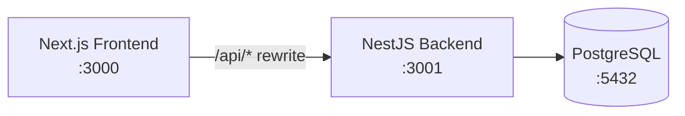

---
tags:
  - overview
---

# Project Overview

## Purpose

The **Micro-Messaging Board** is a full-stack web application that lets users:

- Register and log in securely
- Post short messages (≤ 240 characters) with a fixed tag
- Browse a paginated message feed with infinite scroll
- Filter messages by tag, author, and date range
- Edit and delete **only their own** messages (inline in the UI)

## High-level architecture



- **Frontend**: Next.js 14 App Router, React Query, Tailwind CSS
- **Backend**: NestJS with Controller → Service → Repository pattern
- **Database**: PostgreSQL via TypeORM with explicit migrations (no `synchronize`)

## Key design choices

| Area | Decision |
|------|----------|
| Auth | JWT access token (in memory) + refresh token (`httpOnly` cookie) |
| Pagination | Cursor-based on `(created_at, id)` |
| Tags | Fixed enum: General, Tech, Random, Announcement, Question |
| Ownership | `MessageOwnerGuard` on PATCH/DELETE (403 if not owner) |

See also: [[How It Was Built/Architecture Decisions]], [[Overview/Tech Stack]]

## Repository layout

```
root/
├── backend/           NestJS API
├── frontend/          Next.js UI
├── docker-compose.yml PostgreSQL only
├── Project_Plan.md    Requirements & roadmap
└── vault/             This Obsidian knowledge base
```

## Related notes

- [[Getting Started/Running Locally]]
- [[Getting Started/Login and Credentials]]
- [[How It Was Built/Development Phases]]
